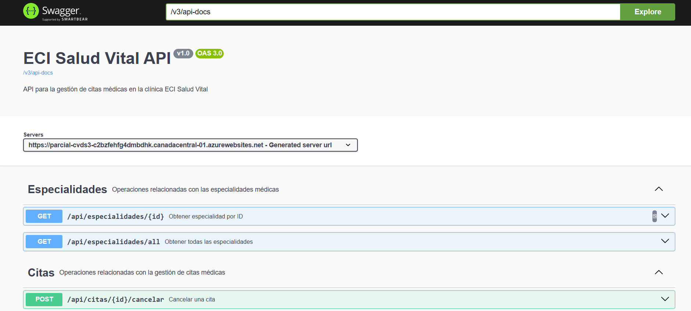

# Backend para Clínica ECI Salud Vital

Este proyecto implementa el backend para la gestión de citas médicas de la Clínica ECI Salud Vital. El sistema permite a los usuarios ver especialidades médicas, programar citas y consultar su historial de citas.

## Estudiante
- Nombre: Alison Geraldine Valderrama Munar

## Diagramas de Arquitectura

### Diagrama de Componentes
```
+----------------+     +----------------+     +----------------+
|                |     |                |     |                |
|    Frontend    |---->|    Backend     |---->|    MongoDB     |
|                |     |                |     |                |
+----------------+     +----------------+     +----------------+
```

### Diagrama de Clases
```
+---------------+     +---------------+     +---------------+
| Especialidad  |     |     Cita      |     |   Controladores|
|---------------|     |---------------|     |---------------|
| - id          |     | - id          |     | - CitaController |
| - nombre      |     | - nombreCompleto |  | - EspecialidadController |
| - descripcion |     | - cedula      |     +---------------+
| - imagenUrl   |     | - correo      |           |
| - doctor      |     | - fechaCita   |           |
| - ubicacion   |     | - especialidad|     +---------------+
+---------------+     | - doctor      |     |   Servicios   |
                      | - ubicacion   |     |---------------|
                      | - estado      |     | - CitaService |
                      +---------------+     | - EspecialidadService |
                                            +---------------+
```

### Modelo de Datos (Colecciones MongoDB)

#### Especialidad
```json
{
  "id": "1",
  "nombre": "Medicina General",
  "descripcion": "Atención médica integral para pacientes de todas las edades.",
  "imagenUrl": "https://ejemplo.com/medicina-general.jpg",
  "doctor": "Dr. Juan Pérez",
  "ubicacion": "Consultorio 101"
}
```

#### Cita
```json
{
  "id": "1234567890",
  "nombreCompleto": "María López",
  "cedula": "1098765432",
  "correo": "maria@example.com",
  "fechaCita": "2025-06-01",
  "especialidad": "Medicina General",
  "doctor": "Dr. Juan Pérez",
  "ubicacion": "Consultorio 101",
  "estado": "Confirmada"
}
```

## Instrucciones para ejecutar

1. Clonar el repositorio
2. Navegar a la carpeta del proyecto
3. Ejecutar `mvn clean install`
4. Ejecutar `mvn spring-boot:run`
5. El servidor estará disponible en http://localhost:8080

## Despliegue en Azure 


Link de despliegue: [ECI Salud Vital](https://parcial-cvds3-c2bzfehfg4dmbdhk.canadacentral-01.azurewebsites.net)

## Documentación de la API

Link de swagger: [Swagger UI](https://parcial-cvds3-c2bzfehfg4dmbdhk.canadacentral-01.azurewebsites.net/swagger-ui/index.html)

## Endpoints

### Citas
- `GET /api/citas/all` - Obtener todas las citas
- `GET /api/citas/{correo}/correo` - Obtener citas por correo
- `GET /api/citas/{correo}/{estado}/filtrar` - Filtrar citas por estado
- `POST /api/citas/crear` - Programar una nueva cita
- `POST /api/citas/{id}/cancelar` - Cancelar una cita

### Especialidades
- `GET /api/especialidades/all` - Obtener todas las especialidades
- `GET /api/especialidades/{id}` - Obtener especialidad por ID


## Tecnologías Utilizadas
- Spring Boot
- MongoDB
- Swagger/OpenAPI
- JUnit para pruebas unitarias
